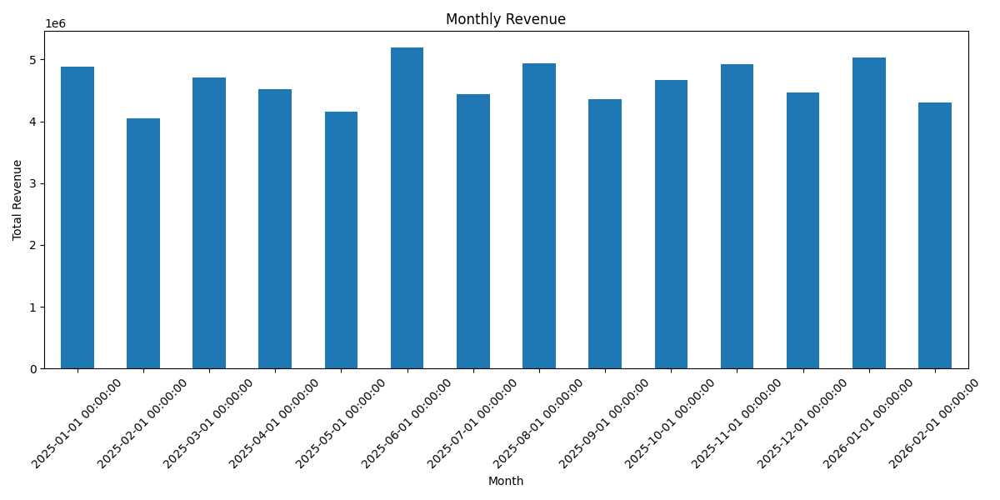
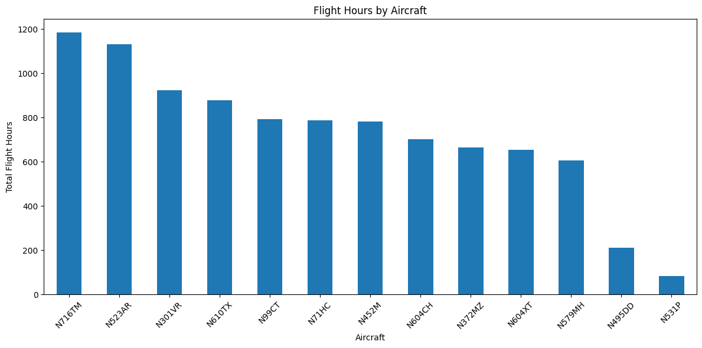
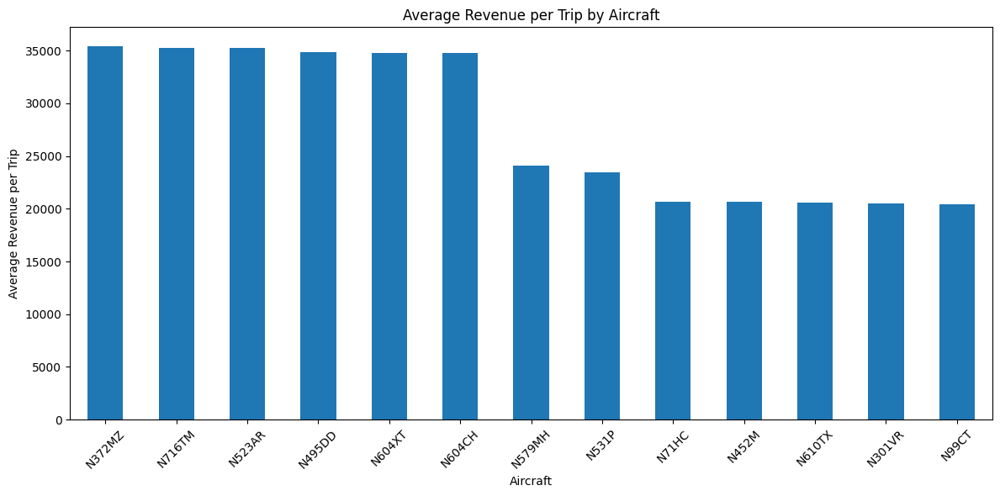
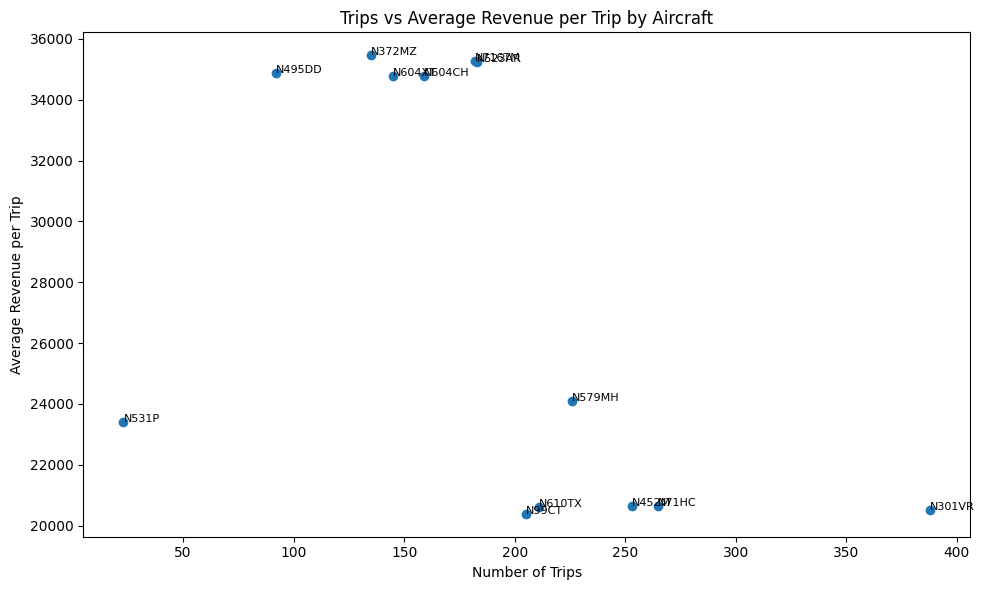

# ✈️ Aviation Operational Analytics

**Operational Analytics Project with IFR Advisors for an Aviation Client**

---
## 📌 Project Preview

This project analyzes how fleet utilization and revenue interact to drive aviation performance.

---

## 🧭 Executive Summary

This project presents an operational analytics framework designed to evaluate fleet performance, revenue generation, and aircraft utilization.

By combining trip-level financial data with flight-level operational data, the analysis reveals a critical insight:

👉 **Not all aircraft serve the same role in the business.**

The fleet operates under a dual-structure model:

- High-frequency aircraft that drive operational volume  
- High-value aircraft that generate higher revenue per mission  

This distinction enables more strategic decision-making across pricing, fleet allocation, and performance monitoring.

---

## 🧩 Business Problem

Aviation operators often lack visibility into:

- Which aircraft drive operational activity  
- Which aircraft generate the most revenue  
- Whether fleet utilization aligns with business strategy  
- How to optimize pricing and aircraft deployment  

Without this clarity, decision-making remains reactive rather than strategic.

---

## 📊 Dataset

This project uses a **synthetic dataset** that replicates a real-world aviation analytics engagement.

### Data Sources Simulated

**Trip-Level Data**
- Aircraft  
- Trip type (Charter / Owner)  
- Revenue per trip  
- Trip start month  

**Flight-Level Data**
- Aircraft  
- Flight hours per leg  

📌 The dataset was designed to reflect realistic operational patterns, including:
- Uneven aircraft utilization  
- Revenue variation across aircraft  
- Stable monthly revenue distribution  

---

## 🔐 Disclaimer

This project is based on a real-world aviation analytics engagement.

The original dataset is confidential and cannot be shared.

A synthetic dataset was created to replicate the structure, behavior, and analytical approach of the original work, without exposing any sensitive information.

All company identifiers, metrics, and operational details have been anonymized or generalized.

---

## 🧠 Analytical Approach

The analysis was structured in four layers:

### 1. KPI Development
- Total Revenue  
- Total Trips  
- Total Flight Hours  
- Average Revenue per Trip  

### 2. Revenue Analysis
- Monthly revenue trends  
- Stability and demand patterns  

### 3. Fleet Utilization Analysis
- Flight hours by aircraft  
- Identification of high-utilization assets  

### 4. Revenue Segmentation
- Average revenue per trip by aircraft  
- Comparison of utilization vs revenue  

---

## 📈 Key Insights

### 1. Revenue Stability
Revenue remains relatively consistent over time, suggesting steady demand rather than reliance on large, irregular transactions.

### 2. Uneven Fleet Utilization
A small subset of aircraft supports a disproportionate share of total flight hours.

### 3. Revenue Variation Across Aircraft
Some aircraft consistently generate higher revenue per trip, indicating different mission profiles or customer segments.

### 4. Dual Fleet Structure (Core Insight)

The fleet naturally segments into two groups:

**High-Volume Aircraft**
- High number of trips  
- Moderate revenue per trip  
- Support operational demand  

**High-Value Aircraft**
- Fewer trips  
- Higher revenue per mission  
- Serve premium or specialized use cases  

---

## 🎯 Strategic Recommendations

- Segment the fleet into operational vs premium categories  
- Align pricing strategy with aircraft role  
- Reevaluate underutilized aircraft  
- Monitor performance at the aircraft level, not just aggregate level  

---

## 💼 Business Impact

This framework enables:

- Improved fleet allocation decisions  
- Better pricing strategy alignment  
- Identification of revenue drivers  
- More effective performance monitoring  

This shifts decision-making from descriptive reporting to strategic optimization.

---

## 🛠 Tools Used

- Python  
- Pandas  
- NumPy  
- Matplotlib  
- Jupyter Notebook  

---

## 📁 Repository Structure

```text
aviation-operational-analytics/
│
├── data/
│   ├── raw/
│   └── synthetic/
│
├── notebooks/
│   └── aviation_analysis.ipynb
│
├── outputs/
│   ├── figures/
│   └── tables/
│
├── reports/
│
├── README.md
├── requirements.txt
└── .gitignore
```

---

## 📌 Key Visualizations

- Monthly Revenue Distribution  
- Flight Hours by Aircraft  
- Average Revenue per Trip by Aircraft  
- Trips vs Average Revenue per Trip (Segmentation Analysis)  

---

## 📊 Visual Examples

### Monthly Revenue


---

### Flight Hours by Aircraft


---

### Average Revenue per Trip by Aircraft


---

### Trips vs Revenue Segmentation


---

## 🧠 Executive Takeaway

Fleet performance is not uniform.

Understanding how aircraft contribute differently to:
- operational volume  
- revenue generation  

is critical for scaling aviation operations and improving profitability.

---

## 🤝 Consulting Relevance

This project reflects real-world consulting work, where the goal is to:

- identify performance drivers  
- uncover structural patterns  
- translate insights into actionable decisions  

---

## 📬 Let’s Connect

If you're working on:
- aviation operations  
- fleet optimization  
- performance analytics  

Let’s connect:

🔗 LinkedIn: https://www.linkedin.com/in/denissepareja/  
📧 Email: dparejaval@gmail.com
